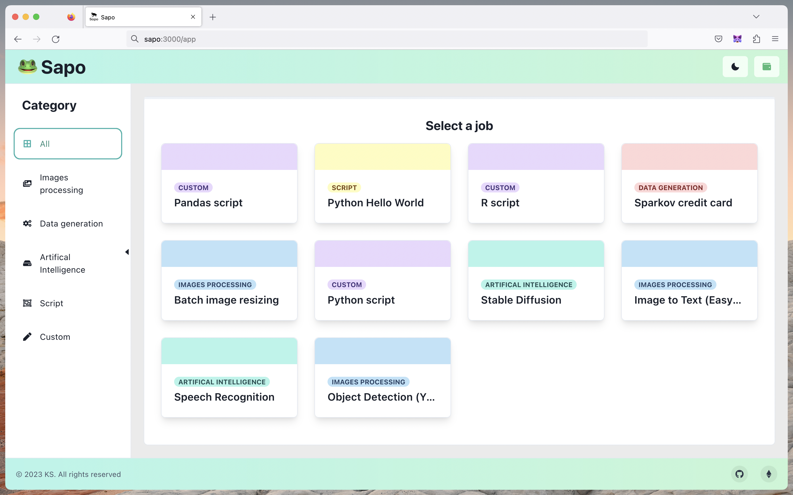

<a name="readme-top"></a>
[](https://github.com/julio4/sapo-fevm)

<!-- PROJECT LOGO -->
<br />
<div align="center" display="flex" flex-direction="row" justify-content="center" align-items="center">
  <a href="https://sapo-sage.vercel.app">
    
  </a>
  <a href="https://sapo-sage.vercel.app">
    
  </a>
  </p>
</div>
<!-- TABLE OF CONTENTS -->
<summary>Table of Contents</summary>
<ol>
<li>
    <a href="#about-the-project">About The Project</a>
</li>
<li>
    <a href="#getting-started">Getting Started</a>
    <ul>
    <li><a href="#prerequisites">Prerequisites</a></li>
    <li><a href="#installation">Installation</a></li>
    </ul>
</li>
<li>
    <a href="#goal">Goal</a>
</li>
<li>
    <a href="#features">Features</a>
</li>
<li><a href="#contact">Contact</a></li>
</ol>
<br />
<!-- ABOUT THE PROJECT -->

## About The Project


Sapo is a decentralized cloud computing platform that leverages the Filecoin EVM and Bacalhau compute over data ecosystem. The main goal of Sapo is to provide an easy way to perform fully decentralized computation, enabling users to create more value from their data stored on Filecoin.

Test the dApp here: [Sapo Website](https://sapo-sage.vercel.app/)

<br />

<p align="center">
  
</p>
<p align="right">(<a href="#readme-top">back to top</a>)</p>

<!-- GETTING STARTED -->

## Getting Started

To get a local copy up and running follow these simple example steps.

### Prerequisites

    A web3 browser (e.g. MetaMask)
    An Ethereum wallet with some Hyperspace testnet tokens
    Hardhat framework to test and deploy

### Installation

Clone the repo

```sh
git clone https://github.com/julio4/sapo-fevm.git
```

Install package dependencies using yarn or npm

```sh
yarn install
```

<p align="right">(<a href="#readme-top">back to top</a>)</p>

<!-- GOAL -->

</br>

## Goal

The goal of Sapo is to revolutionize decentralized cloud computing by offering a comprehensive and user-friendly solution for Data Daos, researchers, and developers. With enhanced security, privacy, and control, Sapo enables its users to harness the full potential of decentralized computing for both generic and custom computing jobs. Our seamless one-stop platform empowers users to tackle even the most complex data-driven tasks with ease.

## Features

#### What can you already do with Sapo?

- Import Files: Directly import your files from IPFS or your Data DAO into Sapo.
- Request Computation: Request a new job to compute your data on chain
- Job Monitoring: Check the status of your computation with Bacalhau
- Results: Quickly access the result of your computation through the user-friendly front-end.

#### More to come

- Deterministic Verification: Verify the accuracy of your computation results on the blockchain.
- Custom Jobs: Create and run custom computation jobs directly from the Sapo front-end.
- Increased Scalability: Enhance the scalability of the platform to accommodate growing demands and larger computation jobs.
- Job Notifications: Integrate with the Push Protocol to notify users about the status of their computation jobs in real-time.

</br>

<!-- CONTACT -->

## Contact

Website: [https://sapo-sage.vercel.app/](https://sapo-sage.vercel.app/)
<br />
ETH Global Hackathon: [Project Page](https://ethglobal.com/showcase/sapo-wtdhn)
<br />

<p align="right">(<a href="#readme-top">back to top</a>)</p>
